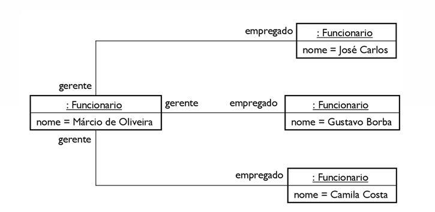
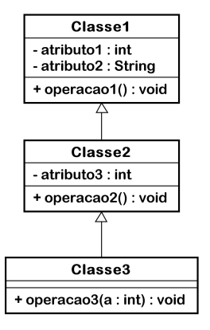

# Relacionamentos

## Associações

- Dois objetos podem estar ligados um ao outro.  
  - A ligação permite navegar de um objeto ao outro.
- Para que seja possível ligar objetos, as classes destes objetos devem estar relacionadas através de uma associação.
  - A associação é um tipo de relacionamento que conecta duas classes.


### Aprimoramentos da Associação

- As associações podem ser melhor detalhadas através de aprimoramentos (também conhecidos como adornos).
- Existem 4 tipos de aprimoramentos:
  - Papel
  - Nome
  - Multiplicidade
  - Navegabilidade

### Associação - Papel

- Cada classe que participa de uma associação tem um papel específico.
- É possível nomear explicitamente o papel de uma classe no relacionamento.


### Associação - Nome

- Uma associação pode ter um nome, que pode ser utilizado para descrever a natureza do relacionamento.
- Pode ser indicada a direção da leitura do nome, utilizando-se uma seta.


### Multiplicidade

- Determina a quantidade de objetos que podem ser interconectados.
- A “quantidade” é chamada de multiplicidade.
- Escrita com uma expressão indicando valor mínimo e máximo.


#### Exemplo de Multiplicidade:

- Perguntas para preencher a multiplicidade:
  - No mínimo: Quantos livros um autor pode escrever?  
    Resposta: 0 (nenhum).
  - No máximo: Quantos livros um autor pode escrever?  
    Resposta: * (indeterminado).

- Outro exemplo:
  - No mínimo: Quantos autores podem escrever uma obra?  
    Resposta: 1.
  - No máximo: Quantos autores podem escrever uma obra?  
    Resposta: * (indeterminado).

### Diagrama de objetos exemplo


### Multiplicidade - Significados

| Multiplicidade | Significado |
|----------------|-------------|
| 0..1           | Não é necessário haver um relacionamento, mas se houver, será com uma única instância. |
| 1 (ou 1..1)    | Apenas um objeto da classe se relaciona com os objetos de outra classe. |
| 0..*           | Pode ou não haver instâncias da classe participando do relacionamento. |
| 1..*           | Há pelo menos um objeto envolvido no relacionamento, podendo haver muitos. |
| 3..5           | Há pelo menos 3 instâncias envolvidas no relacionamento, mas não mais que 5. |

### Navegabilidade

- Por padrão, a navegação entre objetos é bidirecional.
- É possível limitar a navegação para uma única direção, desenhando-se uma seta (navegação unidirecional).

#### Exemplo de Navegabilidade:

- A partir de um livro é possível navegar até seus autores.
- A partir de uma pessoa é possível navegar até suas obras.

### Associação Reflexiva



- É uma associação que estabelece uma conexão entre objetos de uma mesma classe.


# Relacionamento entre Objetos

## Associações

- Acompanhada de adornos (ou aprimoramentos):
  - Nome
  - Papel
  - Multiplicidade
  - Navegabilidade

## Associações com Multiplicidade 0..1 ou 1


- Tradução para Java requer:
  - Criar uma variável de instância na classe de origem
    - O identificador desta variável deve ser igual ao papel que está próximo à classe de destino
    - Na ausência de papel, utilizar o nome da classe como identificador
    - O tipo de dado desta variável deve ser igual à classe de destino

### Classe Origem
- Sentido da navegação
- Tradução para Java requer:
  - Criar uma variável de instância na classe de origem.

### Classe Destino
- O identificador desta variável deve ser igual ao papel que está próximo à classe de destino.
- Na ausência de papel, utilizar o nome da classe como identificador.
- O tipo de dado desta variável deve ser igual à classe de destino.

### Representação Alternativa
- Apresenta o relacionamento de forma redundante.
- Geralmente utiliza-se métodos de acesso para manipular a nova variável de instância.

## Exemplo em Java

```java
public class Departamento {
    private String nome;
    private Funcionario gerente;

    public String getNome() {
        return nome;
    }

    public void setNome(String nome) {
        this.nome = nome;
    }

    public Funcionario getGerente() {
        return gerente;
    }

    public void setGerente(Funcionario gerente) {
        this.gerente = gerente;
    }
}
```

## Exemplo de utilização

```java
public void exemplo() {      
    Funcionario f1 = new Funcionario();
    f1.setNome("Juliano Korz");
    f1.setRamal(4901);
    Departamento d1 = new Departamento();
    d1.setNome("Contabilidade");
    d1.setGerente(f1);
}
System.out.println( d1.getGerente().getNome() )
```

## Relacionamento bidirecional


## Exemplo de utilização

```java
public void exemplo() {   
    Funcionario f1 = new Funcionario();
    f1.setNome("Juliano Korz");
    f1.setRamal(4901);
    Departamento d1 = new Departamento();
    d1.setNome("Contabilidade");
    d1.setGerente(f1);
    f1.setDepartamentoGerenciado(d1);
    System.out.println( d1.getGerente().getNome() );
    System.out.println( f1.getDepartamentoGerenciado().getNome())
}

```

# ArrayList

- Uma instância da classe `ArrayList` pode armazenar diversos objetos
  - Forma alternativa ao vetor para guardar dados
  - Não possui tamanho limitado, como no vetor
  - Não armazena dados primitivos
- Os objetos armazenados no objeto da classe `ArrayList` são recuperados pela posição

## A classe ArrayList 

| Método         | Descrição                              |
|----------------|----------------------------------------|
| `add(E)`       | Guarda um objeto                       |
| `get(int)`     | Obtém um objeto na posição indicada    |
| `remove(Object)` | Remove o objeto                       |
| `size()`       | Retorna a quantidade de objetos armazenados |

O construtor padrão cria um `ArrayList` vazio. Usamos o operador diamante para indicar o tipo dos objetos que se quer armazenar. É possível combinar a declaração e criação:

```java
ArrayList<Aluno> turma;
turma = new ArrayList<>();
```
É possível combinar a declaração e criação:
```java
ArrayList<Aluno> turma = new ArrayList<>();
```
## Exemplo
```java
public static void main(String[] args) {
    ArrayList<Aluno> turma = new ArrayList<>();
    Aluno a1 = new Aluno("Leonir Santos");
    turma.add(a1);
    Aluno a2 = new Aluno("Anderson Gonçalves");
    turma.add(a2);
    turma.add(new Aluno("Jean Cardoso"));
    ...
}
```
## Exemplo – Percorrendo o ArrayList
```java
Aluno aluno;
for (int i = 0; i < turma.size(); i++) {
    aluno = turma.get(i);
    System.out.println(aluno.getNome());
}

for (Aluno aluno : turma) {
    System.out.println(aluno.getNome());
}
```

# Relacionamento entre objetos

## Dependência

- Indica que objetos de duas classes se relacionam temporariamente para atender uma funcionalidade.
- Define que se a classe na extremidade da seta mudar, isso afetará a classe dependente.

### Dependência - Exemplo

No programa, a dependência pode ocorrer através de:

- Parâmetro de método
- Retorno de método
- Variável local

```java
public class Dependente {
    public void metodo1(Classe1 c) {
        ...
    }
    public Classe2 metodo2() {
        ...
    }
    public void metodo3() {
        Classe3 c;
        c = new Classe3();
    }
}
```

## Especializações de associação

São associações em que uma das classes faz papel de “todo” enquanto que a outra classe faz papel de “parte” (relacionamento todo/parte).

Exemplo:
  - As associações todo/parte podem ser classificadas em:
  - Agregação
  - Composição

### Agregação

- A parte pode existir sem o todo.
- Um objeto “parte” pode estar agregado a outros objetos “todo”.
- Na UML, é desenhado com um losango próximo à classe que faz o papel de “todo” – adorno “agregação”.

### Composição

- Similar à agregação, porém na composição o objeto que faz papel de “todo” é responsável por criar e destruir suas partes.
- Quando o objeto “todo” é destruído, suas partes também são.
- Os objetos que fazem papel de parte não podem pertencer a mais de um todo.
- Conforme (BRAUDE, 2005), na composição nenhum outro objeto pode referenciar o objeto composto. “O objeto composto só existe no escopo do objeto proprietário”.
- A variável que mantém o objeto parte deve ser privada.
- Não pode existir getter ou setter para acessar o objeto parte.

### Agregação X Composição

Em Java, como a destruição é automática, a definição se utiliza agregação ou composição resume-se ao seguinte:

- A parte é acessível a outros objetos além do todo?
  - Se sim: é agregação,
  - Se não: é composição.

## Exemplo

```java
public class Motor {
    private double potenciaMotor;
    private String serie;
}

public class Carro {
    private String fabricante;
    private int ano;
}
```

### Exemplo de agregação

```java
public class Motor {
    private double potenciaMotor;
    private String serie;

    public Motor(double potenciaMotor, String serie) {
        this.potenciaMotor = potenciaMotor;
        this.serie = serie;
    }

    public double getPotenciaMotor() {
        return potenciaMotor;
    }

    public String getSerie() {
        return serie;
    }
}

public class Carro {
    private String fabricante;
    private int ano;
    private Motor motor;

    public Carro(String fabricante, int ano, Motor motor) {
        this.fabricante = fabricante;
        this.ano = ano;
        this.motor = motor;
    }

    public String getFabricante() {
        return fabricante;
    }

    public int getAno() {
        return ano;
    }

    public Motor getMotor() {
        return motor;
    }

    public void setMotor(Motor motor) {
        this.motor = motor;
    }
}

// Exemplo de uso
public class Main {
    public static void main(String[] args) {
        Motor motor = new Motor(1.3, "344543533");
        Carro meuCarro = new Carro("Fiat", 2010, motor);

        // Exemplo de agregação
        meuCarro = null;
        // Motor ainda existe, pois é uma agregação

        // Criar novo carro e associar o motor
        meuCarro = new Carro("Fiat", 2010, motor);
        meuCarro = null;
    }
}
```

### Exemplo de composição

```java
public class Carro {
    private String fabricante;
    private int ano;
    private Motor motor;
    public Carro(String fabricante, int ano, double potencia, String serie) {
        this.fabricante = fabricante;
        this.ano = ano;
        this.motor = new Motor(potencia, serie);
    }
    public String getFabricante() {
        return fabricante;
    }
    public int getAno() {
        return ano;
    }
    public double getPotenciaMotor() {
        return motor.getPotencia();
    }
    public String getSerieMotor() {
        return motor.getSerie();
    }
}

```

# Herança (Parte 1)

## Herança

- Uma forma de reuso de software em que uma nova classe é criada absorvendo os membros (atributos e métodos) de uma classe já existente.
- A classe já existente é chamada de superclasse, classe pai ou classe base.
- A nova classe é chamada de subclasse, classe filha ou classe derivada.
- A subclasse pode adicionar seus próprios membros.

## Herança – Representação em UML


- A herança é uma forma de reuso
- A subclasse é mais específica que a sua superclasse, representando um grupo de objetos mais especializado
  - A herança também é conhecida como “especialização”

### Exemplo de Herança

```java
public class Calculadora {
    private double memoria;

    public double getMemoria() {
        return memoria;
    }

    public void setMemoria(double mem) {
        this.memoria = mem;
    }

    public double somar(double op1, double op2) {
        return op1 + op2;
    }

    public double subtrair(double op1, double op2) {
        return op1 - op2;
    }

    public double multiplicar(double op1, double op2) {
        return op1 * op2;
    }

    public double dividir(double op1, double op2) {
        return op1 / op2;
    }
}

public class CalculadoraCientifica extends Calculadora {
    public double raizQuadrada(double op) {
        // Implementação
    }

    public double exponenciacao(int base, int expoente) {
        // Implementação
    }

    public long fatorial(int op) {
        // Implementação
    }
}
```

## Exemplo 

- A subclasse é uma versão especializada da superclasse
- Dizemos que CalculadoraCientifica estende a classe Calculadora ou CalculadoraCientifica herdaa classe Calculadora

```java
public class CalculadoraCientifica extends Calculadora {
    public double raizQuadrada(double op) {
    // ...
    }
    public double exponenciacao(int base, int expoente) {
    // ...
    }
    public long fatorial(int op) {
    // ...
}
}
```

## Exemplo programa principal.
```java
public static void main(String[] args) {
    CalculadoraCientifica cs = new CalculadoraCientifica();
    System.out.println(cs.somar(12,13));
    System.out.println(cs.fatorial(5));
}
```

## Herança é um relacionamento
  - A herança é um relacionamento entre classes
  - Lemos o relacionamento com a expressão “é um(a)
  - CalculadoraCientifica é uma Calculadora

## Herança



- É possível especializar classes construídas pelo próprio programador, bem como especializar classes de terceiros, como as classes da própria linguagem Java.
- Cada subclasse pode ser uma superclasse de futuras subclasses.
- A superclasse direta é a superclasse herdada diretamente por uma subclasse
- A superclasse indireta é a superclasse herdada indiretamente

## Herança


As relações de herança formam estruturas hierárquicas parecidas com uma árvore. Esta hierarquia de classes também é conhecida como hierarquia de herança

Object => Component => Container => JComponent => JLabel
                                               => JPanel
                                               => JTextComponent => JTextField
                                                                 => JTextArea

##  Herança X membros privados
Uma subclasse não pode acessar membros privados de sua superclasse.

``` java
// Classe1.java
public class Classe1 {
    private int valor;

    // Getter
    public int getValor() {
        return valor;
    }

    // Setter
    public void setValor(int valor) {
        this.valor = valor;
    }
}

// Classe2.java
public class Classe2 extends Classe1 {

    private void tentarAtribuirValor() {
        valor = 10 // erro dew compilação
    }
}

```

-  Se a variável é privada e o setter não é público (ou não há setter), para acessar a variável na subclasse, recomenda-se:
  - Manter privada a variável de instância
  - Tornar (ou criar) o setter com modificador de acesso protected (protegido)
- O modificador de acesso protected torna o membro acessível:
  - pela própria classe,
  - classes do mesmo pacote e
  - Subclasses
- Em UML, o membro protegido utiliza o símbolo #

## Herança e sobrescrita de método
Na subclasse, além de incluir novos atributos e novos métodos, é possível modificar (redefinir) o comportamento de métodos herdados. Esta funcionalidade é chamada de “sobrescrita de método


```java
public void sacar(double valor) { // Classe 01
    if (valor > saldo)
        throw new IllegalArgumentException("Sem saldo");
      
    saldo -= valor;
}
public void sacar(double valor) { // Classe 02 que extende e sobreescreve sacar de Classe 01
    if (valor > getSaldo()+getLimiteCredito())
        throw new IllegalArgumentException("Sem saldo");
    
    saldo = saldo - valor; // Erro de compilação
}
```

## Exemplo de sobrescrita de método
Como a subclasse precisa alterar o saldo, é preciso implementar o método setSaldo() na superclasse, porém de forma protegida.


## Sobrescrita de método
  - Na tentativa de sobrescrever um método, o programador pode escrever o nome ou parâmetros incorretos, e ao invés de sobrescrever o método, introduz um novo método sobrecarregado.
  - A classe ContaEspecial agora tem dois métodos sacar(), um para sacar valores com decimais e outro para sacar valores inteiros.
  - Para evitar este problema, na subclasse, recomenda-se utilizar a anotação @Override imediatamente antes do método para que o compilador confira se o método existe na superclasse.
  - É frequente o método sobrescrito de uma subclasse querer reutilizar o método da superclasse para executar parte do trabalho. Para isso, utilizar a palavra super para referenciar o método da superclasse.
  - Exemplo: 
  
```java
@Override
public void calcularTotal() {
    setDesconto(10);
    setIcms(7);
    super.calcularTotal();
}
```

## Classe Object
  - Em Java, todas as classes herdam a classe Object (direta ou indiretamente), que está no pacote java.lang.

## Herança X Construtores
Em Java, os construtores da superclasse não são herdados nas subclasses.
  - Ao criar um objeto de uma classe, todos os seus construtores devem chamar algum construtor da superclasse imediata
  - Para chamar o construtor da superclasse:
  
```java
super();
```

  - Exemplo:
```java
public class Classe2 extends Classe1 {
    public Classe2() {
        super(30);
        System.out.println("Classe2");
    }
}
```
  - O comando super() deve ser o primeiro comando do construtor.
  - A chamada obrigatória de um construtor da superclasse leva a uma execução em cascata do construtor de todas as classes da hierarquia de herança
  - A execução do construtor ocorre da classe de mais alto nível até atingir a classe que está sendo instanciada:


  - Se a superclasse imediata possuir um construtor padrão, este é chamado automaticamente em todos os construtores da subclasse
    - O compilador introduz o comando super() como sendo a primeira linha de código de cada construtor
    - Se a superclasse imediata não possuir um construtor padrão, o programador deverá chamar o construtor da superclasse de forma explícita.


  - O construtor da superclasse deve ser chamado explicitamente, já que a superclasse não tem construtor padrão
  - O compilador adiciona esta chamada automaticamente
  - Se nenhum construtor é declarado, Java introduz o construtor padrão, fazendo uma chamada ao construtor padrão da superclasse.
  - Se nenhum construtor é declarado e a superclasse não tem construtor padrão, o programador deve criar explicitamente um construtor

## Diversos
Java é uma linguagem de herança simples, ao contrário de algumas linguagens que são de herança múltipla, permitindo várias superclasses diretas para uma mesma classe

## Generalização

- É um processo de encontrar e criar superclasses:
  - Num conjunto de classes relacionadas, localizar os membros (métodos e atributos) comuns entre as classes;
  - Mover os membros comuns para uma classe, tornando-a superclasse das classes originais;
  - Para os métodos que tiverem método diferenciado, manter na classe original.

## Exemplo de Aplicação


- Mantido porque tem algoritmo diferente dos demais.
- O processo de generalização pode ser aplicado mais vezes, com um conjunto menor de classes.
- Se após aplicar o processo de generalização, uma classe não possuir membro algum, esta classe pode ser promovida para ser superclasse das demais classes.


## Generalização em Muitas Ocasiões

- Em muitas ocasiões, a superclasse que surgiu a partir do processo de generalização não tem um significado no mundo real:
  - Trata-se de um efeito do processo de generalização;
  - A superclasse pode representar um conceito abstrato que não existe no mundo real.

## Classe Abstrata

- Uma classe que representa um conceito genérico.
- Em UML, é expressa com o nome da classe em itálico.
- Em Java, utiliza-se o modificador `abstract`, como em:

```java
public abstract class ContaBancaria {
  // ...
}
```
- Por ser uma abstração, não é possível criar objetos de classes abstratas.
- Classes abstratas precisam ser estendidas para serem reutilizadas:
  - Classes que não são abstratas são conhecidas como classes concretas;
  - Somente classes concretas podem ser instanciadas.

```java
Classe1 c1 = new Classe1();
public abstract class Classe1 {
  // Erro de compilação: "não pode instanciar Classe1"
}
```

## Métodos abstratos

### Motivação - Métodos abstratos


- Como evitar esta implementação?

```java
public class Figura {
  private Color cor;
  public void desenhar() {
    // implementação
  }
}
public class Pentagono extends Figura {
  // implementação
}
```
- Definindo um método como abstrato, instruímos o compilador a exigir que as subclasses implementem um método com tal assinatura.
- Em UML, os métodos abstratos são escritos em itálico.

## Exemplo
- Ao especificar o método desenhar() como abstrato:


```java
public class Pentagono extends Figura {
    // Erro de compilação: “Pentagono precisa implementar o método abstrato desenhar()”
}
```

- Um método abstrato é um método que não possui implementação, pois espera-se que as subclasses se encarreguem de implementá-lo.
- Declaramos um método abstrato para indicar que o método deve existir na subclasse, embora não há implementação para o método na superclasse
- Qualquer classe que contém um método abstrato deve ser abstrata também
- Métodos abstratos são declarados com o modificador abstract antes do tipo de retorno
- Não possuem corpo

```java
public abstract class Figura {
    private Color cor;
    public abstract void desenhar();
}
```

- Uma classe abstrata pode ser especializada a partir de uma classe concreta

### Impedir que um método seja sobrescrito
-  Em algumas ocasiões, um método possui uma implementação que não deveria estar sujeito a ser alterado através da sobrescrita de métodos em subclasses, pois a mudança de algoritmo pode tornar o estado do objeto inconsistente.
- Para impedir que um método seja sobrescrito na subclasse, utilizar a palavra reservada final, antes do tipo de dado de retorno, como em:

```java
public final void metodo1() {
    // ...
}
```

### Impedir que uma classe seja estendida
- É possível impedir a extensão de uma classe. Para isso, utilizar a palavra reservada final antes da palavra class, como em:

```java
public final class Classe1 {
    // ...
}
public class Classe2 extends Classe1 {
    // Erro de compilação
}
```

- Este recurso é útil, por exemplo, para criar classes de objetos imutáveis, como os objetos da classe String.